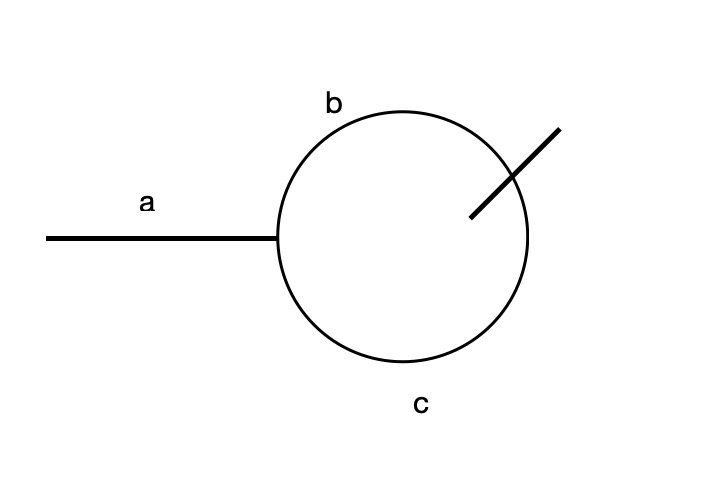

## 环形链表 II

题目链接：[142. 环形链表 II](https://leetcode-cn.com/problems/linked-list-cycle-ii/)

#### 使用set

和 [141. 环形链表](https://leetcode-cn.com/problems/linked-list-cycle/) 题目的解法差不多，这里使用set保存之前访问过的节点，
只要存在相同节点就是有环，直接返回该节点。

```js
var detectCycle = function(head) {
    const set = new Set()

    while (head) {
        if (set.has(head)) {
            return head
        }
        set.add(head)
        head = head.next
    }

    return null
};
```

#### 快慢指针

我们还可以使用快慢指针来解这道题，这样可以达到O(1)的空间复杂度。为什么可以使用快慢指针？这里大概讲解一下：

设起始点到环节点的距离为`a`，环节点到相遇节点距离为`b`，相遇节点再到环节点距离为`c`；如下图所示：



快指针走的距离：`a + n(b + c) + b`

慢指针走的距离：`a + b`

根据 `fast = 2slow` 可以推出：

`a + n(b + c) + b = a + (n + 1)b + nc = 2(a + b)`

`a = (n - 1)(b + c) + c`

从这个结果可以看出，`a` 的距离相当于 `c` 的距离再加上 `n - 1` 个环的距离。

我们可以再使用一个指针指向头部，随后这个指针和slow指针每次移动一步，最终两者相遇就是环的节点。

```js
var detectCycle = function(head) {
  let fast = head, slow = head

  while (fast && fast.next) {
    fast = fast.next.next
    slow = slow.next

    if (fast === slow) {
      break
    }
  }

  if (!fast || !fast.next) return null

  fast = head

  while (fast !== slow) {
    fast = fast.next
    slow = slow.next
  }

  return fast
};
```

这里是参考的官方题解，另外还有个题解也很不错，链接如下：

[环形链表 II 官方题解](https://leetcode-cn.com/problems/linked-list-cycle-ii/solution/huan-xing-lian-biao-ii-by-leetcode-solution/)

[环形链表 II（双指针法，清晰图解）](https://leetcode-cn.com/problems/linked-list-cycle-ii/solution/linked-list-cycle-ii-kuai-man-zhi-zhen-shuang-zhi-/)
